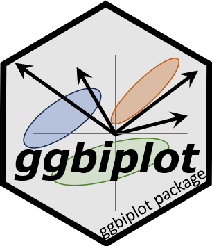

<!-- README.md is generated from README.Rmd. Please edit that file -->

<!-- badges: start -->
[](https://CRAN.R-project.org/package=ggbiplot)
[](https://github.com/friendly/ggbiplot)
<!-- badges: end -->


This repo for the [ggbiplot package](https://CRAN.R-project.org/package=ggbiplot)
was forked from [https://github.com/vqv/ggbiplot](https://github.com/vqv/ggbiplot) by Vince Yu, which has been dormant
since 2015.  

The goal is to complete that development and publish a new version on CRAN.
There is also an [experimental branch](https://github.com/friendly/ggbiplot/tree/experimental) which attempts to
simplify the code, but this has some unresolved problems.

```{r, echo = FALSE}
knitr::opts_chunk$set(
  collapse = TRUE,
  message = FALSE, 
  warning = FALSE,
  comment = "#>",
  fig.path = "man/figures/README-"
)
```

# ggbiplot 

An implementation of the biplot using `ggplot2`.  The package provides two functions: `ggscreeplot()` and `ggbiplot()`.
`ggbiplot` aims to be a drop-in replacement for the built-in R function `biplot.princomp()` with extended functionality 
for labeling groups, drawing a correlation circle, and adding Normal probability ellipsoids.


## Installation

Install the current master branch with:

```r
remotes::install_github("friendly/ggbiplot")
```

## Example Usage

### Wine data

The `wine` data contains results of a chemical analysis of wines grown in the same region in Italy,
derived from three different cultivars. The analysis determined the 
quantities of 13 chemical constituents found in each of the three types of wines. 
The grape varieties (cultivars), **barolo**, **barbera**, and **grignolino**, are given in `wine.class`.

What can we understand about the differences among these wines from a biplot?

```{r wine-screeplot}
library(ggbiplot)
library(ggplot2)
library(dplyr)

data(wine)
wine.pca <- prcomp(wine, scale. = TRUE)
ggscreeplot(wine.pca) +
  theme_bw(base_size = 14)
```

Hmm. The screeplot shows that more than two dimensions are necessary to account for most of the variance.

Plot the first two PCA dimensions, accounting for 55% of the variance.
```{r wine-biplot}
ggbiplot(wine.pca, 
  obs.scale = 1, var.scale = 1,
  groups = wine.class, 
  ellipse = TRUE, 
  circle = TRUE) +
  labs(fill = "Cultivar", color = "Cultivar") +
  theme(legend.direction = 'horizontal', legend.position = 'top')
```

The three cultivars are arranged along the first dimension, in the order barolo < grignolino < barbera.
These are distinguished largely by a conrtast between (`Phenols`, `Flav`) vs. (`NonFlavPhenols`, `AlcAsh`).
The second dimension is represented by the cluster of variables `Mg`, `Alcohol`, `Ash`, `Color`, which distinguishes
grignolino from the other two.

### Iris data

```{r iris-pca}
data(iris)
iris.pca <- prcomp (~ Sepal.Length + Sepal.Width + Petal.Length + Petal.Width,
                    data=iris,
                    scale. = TRUE)
summary(iris.pca)
```

Plot the first two dimensions:

```{r iris-biplot0}
iris.gg <-
ggbiplot(iris.pca, obs.scale = 1, var.scale = 1,
         groups = iris$Species, point.size=2,
         varname.size = 5, 
         varname.color = "black",
         varname.adjust = 1.2,
         ellipse = TRUE, 
         circle = TRUE) +
  labs(fill = "Species", color = "Species") +
  theme_minimal(base_size = 14) +
  theme(legend.direction = 'horizontal', legend.position = 'top')

iris.gg
```

It is possible to add annotations to the biplot by making use of the fact that `ggplot()` returns a lot of
information in the `"gg"` object. In particular, the `$data` component contains the scores on the principal
components that are plotted as points here.
Here we add direct labels for the groups and suppress the legend.

```{r iris-labs}
# get means of coordinates by group
group.labs <-
  iris.gg$data |>
  summarise(xvar = mean(xvar),
            yvar = mean(yvar), .by = groups)

group.labs
```

Now, just use `geom_label` to draw labels for the groups.
```{r iris-biplot1}
iris.gg + geom_label(data = group.labs,
                     aes(x = xvar, y=yvar, label=groups),
                     size = 5) +
  theme(legend.position = "none")

```


