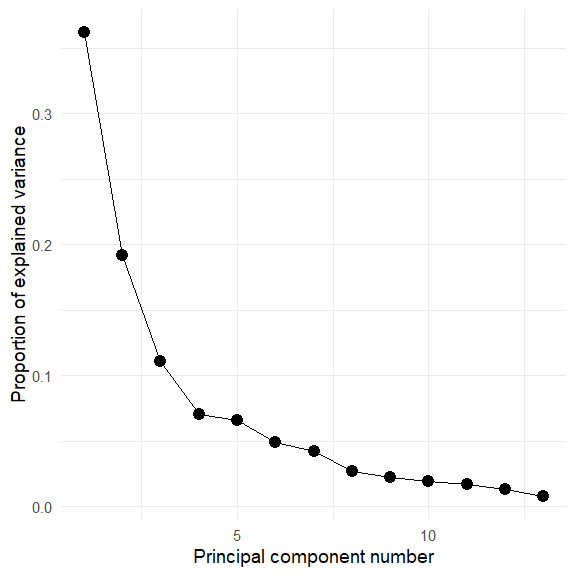
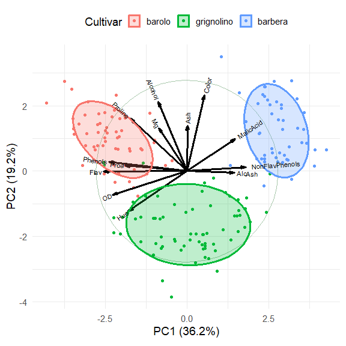
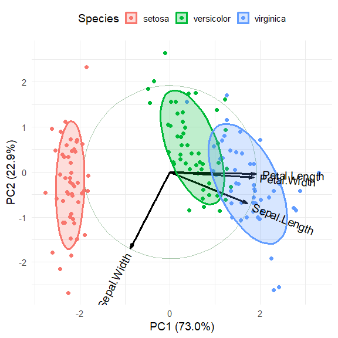
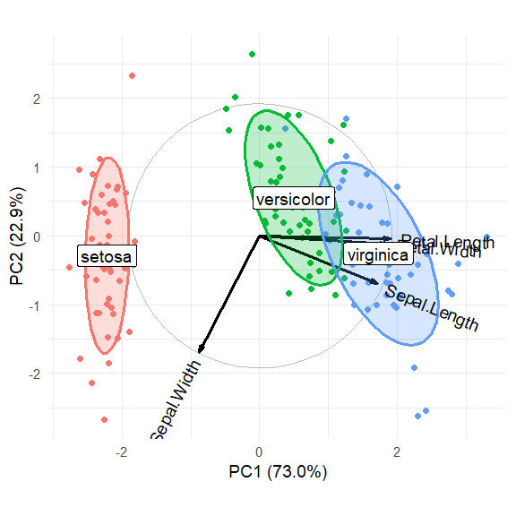

<!-- README.md is generated from README.Rmd. Please edit that file -->
<!-- badges: start -->

[](https://CRAN.R-project.org/package=ggbiplot)
[](https://github.com/friendly/ggbiplot)
<!-- badges: end -->

This repo for the [ggbiplot
package](https://CRAN.R-project.org/package=ggbiplot) was forked from
<https://github.com/vqv/ggbiplot> by Vince Yu, which has been dormant
since 2015.

The goal is to complete that development and publish a new version on
CRAN. There is also an [experimental
branch](https://github.com/friendly/ggbiplot/tree/experimental) which
attempts to simplify the code, but this has some unresolved problems.

# ggbiplot 

An implementation of the biplot using `ggplot2`. The package provides
two functions: `ggscreeplot()` and `ggbiplot()`. `ggbiplot` aims to be a
drop-in replacement for the built-in R function `biplot.princomp()` with
extended functionality for labeling groups, drawing a correlation
circle, and adding Normal probability ellipsoids.

## Installation

Install the current master branch with:

``` r
remotes::install_github("friendly/ggbiplot")
```

## Examples

Load packages:

``` r
library(ggplot2)
library(ggbiplot)
library(dplyr)
library(corrplot)

# set ggplot2 theme
theme_set(theme_minimal(base_size = 14))
```

### Crime data

The `crime` data gives rates of various serious crimes in each of the 50
U. S. states, originally from the United States Statistical Abstracts
(1970).

Let’s take a quick look at the correlations among these, using
`corrplot::corrplot()` and showing each correlation by an ellipse whose
eccentricity and shading represents the value of the correlation.

``` r
data(crime)
crime |> 
  dplyr::select(where(is.numeric)) |> 
  cor() |> 
  corrplot(method = "ellipse")
```

<!-- -->

The correlations are all positive. Note also that the variables in the
dataset are ordered in seriousness or violence, ranging from murder to
auto theft.

Carry out a PCA:

``` r
crime.pca <- 
  crime |> 
  dplyr::select(where(is.numeric)) |>
  prcomp(scale. = TRUE)

crime.pca
#> Standard deviations (1, .., p=7):
#> [1] 2.029 1.113 0.852 0.563 0.508 0.471 0.352
#> 
#> Rotation (n x k) = (7 x 7):
#>             PC1     PC2     PC3     PC4     PC5     PC6     PC7
#> murder   -0.300 -0.6292  0.1782 -0.2321  0.5381  0.2591  0.2676
#> rape     -0.432 -0.1694 -0.2442  0.0622  0.1885 -0.7733 -0.2965
#> robbery  -0.397  0.0422  0.4959 -0.5580 -0.5200 -0.1144 -0.0039
#> assault  -0.397 -0.3435 -0.0695  0.6298 -0.5067  0.1724  0.1917
#> burglary -0.440  0.2033 -0.2099 -0.0576  0.1010  0.5360 -0.6481
#> larceny  -0.357  0.4023 -0.5392 -0.2349  0.0301  0.0394  0.6017
#> auto     -0.295  0.5024  0.5684  0.4192  0.3698 -0.0573  0.1470
```

The biplot, using default scaling (standardized components), and
labeling the states by their state abbreviation:

``` r
ggbiplot(crime.pca,
         labels = crime$st ,
         circle = TRUE,
         varname.size = 4,
         varname.color = "red") 
```

<!-- -->

The directions of the principal components are arbitrary; we are free to
reflect the variable vectors and component scores to facilitate
interpretation. Also, there seem to be differences among regions of the
U.S., which can be visualized using data ellipses for the component
scores. The `groups` argument allows the observations to colored by
group and to summarized by groups.

``` r
crime.pca <- reflect(crime.pca)
ggbiplot(crime.pca,
         groups = crime$region,
         labels = crime$st,
         labels.size = 4,
         var.factor = 1.4,
         ellipse = TRUE, ellipse.level = 0.5, ellipse.alpha = 0.1,
         circle = TRUE,
         varname.size = 4,
         varname.color = "black") +
  labs(fill = "Region", color = "Region") +
  theme(legend.direction = 'horizontal', legend.position = 'top')
```

<!-- -->

The interpretation of the data is now clear.

- The first dimension, accounting for 58.8% of variance, can be seen to
  represent **overall crime rate**, with Nevada (NV) at the high end and
  North Dakota (ND), South Dakota (SD) and West Virginia (WV) at the low
  end.

- The second dimension, accounting for 17.7% of variance represents a
  contrast between **personal crime vs. property crime**. On this
  dimension, Massachusetts (MA), Rhode Island (RI) are opposed to
  Mississippi (MS), Alabama (AL), Louisiana (LA) and South Carolina
  (SC).

- The regions are represented by the differences in the centers of the
  data ellipses for the scores. Southern states are highest on murder,
  assault and rape, while the Northeast states are highest on auto theft
  and larceny.

- In this standardized view, the angles between variable vectors
  approximate the correlations among the variables, according to
  $\cos (\text{angle}) \approx r$. Thus, `murder` and `auto`, nearly
  $90^o$ reflect a near 0 correlation.

### Wine data

The `wine` data contains results of a chemical analysis of wines grown
in the same region in Italy, derived from three different cultivars. The
analysis determined the quantities of 13 chemical constituents found in
each of the three types of wines. The grape varieties (cultivars),
**barolo**, **barbera**, and **grignolino**, are given in `wine.class`.

What can we understand about the differences among these wines from a
biplot?

``` r
library(ggbiplot)
library(ggplot2)
library(dplyr)

data(wine)
wine.pca <- prcomp(wine, scale. = TRUE)
ggscreeplot(wine.pca) 
```

<!-- -->

Hmm. The screeplot shows that more than two dimensions are necessary to
account for most of the variance.

Plot the first two PCA dimensions, accounting for 55% of the variance.

``` r
ggbiplot(wine.pca, 
  obs.scale = 1, var.scale = 1,
  groups = wine.class, 
  ellipse = TRUE, 
  circle = TRUE) +
  labs(fill = "Cultivar", color = "Cultivar") +
  theme(legend.direction = 'horizontal', legend.position = 'top')
```

<!-- -->

The three cultivars are arranged along the first dimension, in the order
barolo \< grignolino \< barbera. These are distinguished largely by a
conrtast between (`Phenols`, `Flav`) vs. (`NonFlavPhenols`, `AlcAsh`).
The second dimension is represented by the cluster of variables `Mg`,
`Alcohol`, `Ash`, `Color`, which distinguishes grignolino from the other
two.

### Iris data

``` r
data(iris)
iris.pca <- prcomp (~ Sepal.Length + Sepal.Width + Petal.Length + Petal.Width,
                    data=iris,
                    scale. = TRUE)
summary(iris.pca)
#> Importance of components:
#>                         PC1   PC2    PC3     PC4
#> Standard deviation     1.71 0.956 0.3831 0.14393
#> Proportion of Variance 0.73 0.229 0.0367 0.00518
#> Cumulative Proportion  0.73 0.958 0.9948 1.00000
```

Plot the first two dimensions:

``` r
iris.gg <-
ggbiplot(iris.pca, obs.scale = 1, var.scale = 1,
         groups = iris$Species, point.size=2,
         varname.size = 5, 
         varname.color = "black",
         varname.adjust = 1.2,
         ellipse = TRUE, 
         circle = TRUE) +
  labs(fill = "Species", color = "Species") +
  theme_minimal(base_size = 14) +
  theme(legend.direction = 'horizontal', legend.position = 'top')

iris.gg
```

<!-- -->

It is possible to add annotations to the biplot by making use of the
fact that `ggplot()` returns a lot of information in the `"gg"` object.
In particular, the `$data` component contains the scores on the
principal components that are plotted as points here. Here we add direct
labels for the groups and suppress the legend.

``` r
# get means of coordinates by group
group.labs <-
  iris.gg$data |>
  summarise(xvar = mean(xvar),
            yvar = mean(yvar), .by = groups)

group.labs
#>       groups   xvar   yvar
#> 1     setosa -2.217 -0.288
#> 2 versicolor  0.495  0.548
#> 3  virginica  1.723 -0.260
```

Now, just use `geom_label` to draw labels for the groups.

``` r
iris.gg + geom_label(data = group.labs,
                     aes(x = xvar, y=yvar, label=groups),
                     size = 5) +
  theme(legend.position = "none")
```

<!-- -->
