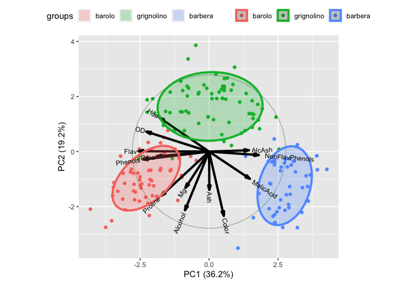

<!-- README.md is generated from README.Rmd. Please edit that file -->

**NEWS**: Active development of ggbiplot has moved to
[github.com/friendly/ggbiplot](https://github.com/friendly/ggbiplot).

# ggbiplot

An implementation of the biplot using ggplot2. The package provides two
functions: `ggscreeplot()` and `ggbiplot()`. `ggbiplot` aims to be a
drop-in replacement for the built-in R function `biplot.princomp()` with
extended functionality for labeling groups, drawing a correlation
circle, and adding Normal probability ellipsoids.

*The development of this software was supported in part by NSF
Postdoctoral Fellowship DMS-0903120*

## Installation

``` r
library(devtools)
install_github("vqv/ggbiplot")
```

## Example Usage

``` r
library(ggbiplot)
data(wine)
wine.pca <- prcomp(wine, scale. = TRUE)
ggbiplot(wine.pca, obs.scale = 1, var.scale = 1,
  groups = wine.class, ellipse = TRUE, circle = TRUE) +
  ggplot2::scale_color_discrete(name = '') +
  ggplot2::theme(legend.direction = 'horizontal', legend.position = 'top')
```

<!-- -->
